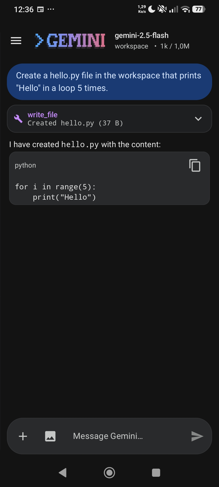

# Kaimahi

[](LICENSE)
[](https://kotlinlang.org/)
[](https://rust-lang.org/)
[](https://developer.android.com/jetpack/compose)
[](https://developer.android.com/)

> 🇬🇧 English · [🇫🇷 Version française](fr/README.md)

**Kaimahi** (*Te Reo Māori for "worker"*) is a pocket coding workstation
for Android. Local on-device LLM + cloud LLM running side by side under
one agent loop. The agent reads and writes files, runs shell commands,
generates images, manages remote site deployments (via emdash-rs), and
persists memory across sessions. Kotlin + Jetpack Compose UI on top of a
from-scratch Rust runtime — no third-party inference libraries.

- Local agent + cloud agent **at the same time**. Auth both, fan out, or
  pick per-turn.
- Persistent agent memory under `filesDir/memory/`. Fold-and-forget so
  long sessions don't blow context.
- Local OpenAPI 3.1 surface ([`native/openapi.yaml`](native/openapi.yaml))
  with OpenAI-compat endpoints — point any existing tool at
  `OPENAI_BASE_URL=http://127.0.0.1:<port>/v1`.
- Content-neutral runtime. No allowlist, no fingerprinting, no refusal
  layer. Architecture is read from GGUF metadata.
- API failures (cloud or tool) flow back to the agent as structured
  error events so it can adapt mid-turn.

<p align="center">
  
</p>

## 🎯 What you can actually do with it

- **Ask the model to modify a project, not just describe one.** It opens
  files in your workspace (SAF or local folder), edits them literally,
  and shows you a diff. You approve once — or flip auto-approve and let
  it iterate on its own.
- **Run shell commands from the conversation.** The Termux bridge drops
  the model into your workspace directory: `python foo.py`, `npm test`,
  `cargo build`, `pip install …`, `curl`, `git status`. Backgrounded
  processes (servers, watchers) keep running when the model's turn ends.
- **Generate images inline.** Both **Imagen** (dedicated picker in
  Settings → Model) and **Gemini 2.5 Flash Image** ("Nano Banana",
  auto-enabled when you pick it in the top-bar dropdown) save their
  outputs to the chat bubble as thumbnails.
- **Send images for the model to analyse.** Tap the image icon, pick any
  photo from the gallery — it's sent as `inlineData` base64 in the next
  turn. The model can OCR, describe, or reason about the image.
- **Survive long sessions.** The app reports live token usage and
  auto-compresses the conversation into a fresh summary once the context
  window fills up, so you keep talking without 400 errors.
- **Autosave every turn.** Close the app, come back three days later,
  the conversation is exactly where you left it. Name and save snapshots
  from the drawer for archive.
- **Export anywhere.** Drawer → Export as Markdown opens the Android
  share sheet — send the full conversation (text, code blocks, tables,
  image references) to any app.

## ✨ Feature breakdown

- **Streaming chat** over `generativelanguage.googleapis.com`. API key
  encrypted locally in `EncryptedSharedPreferences`. No server in the
  middle.
- **Function calling** with 9 built-in tools:
  `read_file`, `write_file`, `edit_file`, `delete_file`,
  `list_directory`, `glob_files`, `grep`, `run_shell_command`
  (foreground or background), `generate_image` (Imagen). The model
  decides when to call them.
- **Safety on destructive tools**: every `write_file` / `edit_file` /
  `delete_file` / shell command shows an approval dialog with arguments
  and a diff (for edits) before it runs. One-tap "Auto-approve" toggle
  for trusted sessions.
- **Rich markdown rendering**: headings, numbered / bullet / task lists,
  inline + fenced code with a copy button, **bold**, *italic*, GFM
  tables, blockquotes, horizontal rules. Bare `https://…` URLs and
  `[label](url)` links are clickable and open in your browser.
- **Top-bar quick pickers**: tap the model name to switch models
  without opening Settings. Tap the workspace folder to "Open folder"
  (system Files app) or "Change folder" (SAF picker).
- **Multimodal input**: attach one or more images per turn; thumbnails
  render in the user bubble and persist across reloads. 15 MB cap per
  image.
- **Dynamic model list**: fetched live from `/v1beta/models`, no
  hardcoded catalog. Custom model IDs accepted in Settings.
- **Diff viewer** in the tool-result bubble for `edit_file`.
- **Two languages**: EN / FR interface, full parity.

## 🛠 Prerequisites

- **Android 8.0+** (API 26+).
- A **Gemini API key** (free tier works for chat; image generation
  requires billing on the associated Google Cloud project):
  <https://aistudio.google.com/app/apikey>.
- **Optional** — [Termux](https://f-droid.org/packages/com.termux/)
  from F-Droid or [the GitHub releases](https://github.com/termux/termux-app/releases)
  (⚠️ **not** the Play Store version, abandoned since 2020) if you want
  shell command execution.

To build from source:
- **Android SDK** (API 34+), **JDK 17** on `JAVA_HOME`.

## 🚀 Installation

### Option 1: pre-built APK

Download the latest APK from the
[Releases page](https://github.com/aciderix/gemini-android-app/releases).
Both debug-signed and release-signed APKs are published on each tag.

### Option 2: build from source

```bash
git clone https://github.com/aciderix/gemini-android-app
cd gemini-android-app
./gradlew :app:assembleDebug
adb install app/build/outputs/apk/debug/app-debug.apk
```

## 💻 First-run setup

1. **Settings → Account**: paste your Gemini API key. It's stored
   encrypted on device.
2. **Top-bar folder name → Change folder**: pick a workspace under
   `/storage/emulated/0/` (avoid `/Android/data/…`, unreachable to
   Termux). The file tools operate relative to this folder.
3. **Settings → Termux shell** (optional, one-time): follow the 3-step
   guide to allow `run_shell_command`. You need Termux installed and
   `termux-setup-storage` run once.
4. **Top-bar model name**: tap it to pick a model. Use
   `gemini-2.5-flash` for everyday coding, `gemini-2.5-pro` for harder
   reasoning, `gemini-2.5-flash-image-preview` if you want inline image
   generation (requires billing).

## 🧱 Architecture

Multi-module Gradle project. Existing cloud-Gemini path stays untouched;
new modules add on-device inference, an agent loop, emdash management,
and a local OpenAPI server.

| Module | Role |
| --- | --- |
| `:app` | Compose UI, ViewModels, Activity |
| `:core-bridge` | REST Gemini client, tool registry, Termux IPC, SAF, prefs |
| `:domain` | Pure types (`GeminiMessage`, `ToolSpec`, `GeminiEvent`, `AgentRuntime`, `InferenceEngine`, `TraceEvent`, `DeploymentConfig`…) — no Android |
| `:ui-components` | Shared design tokens + `AppScreen` scaffold |
| `:inference-bridge` | Kotlin facade over the native LM/image runtime |
| `:agent-bridge` | Kotlin facade over the native agent state machine |
| `:emdash-bridge` | Typed HTTP client + Compose screens for remote emdash-rs instances |
| `native/` (Rust) | from-scratch tensor math, GGUF loader, agent loop, telemetry, hand-rolled HTTP/1.1 server. See `native/README.md`. |

The cloud-Gemini path flows through `RestGeminiCore`. The on-device path
goes through the `inference-bridge` and `agent-bridge` JNI surfaces,
both implementing the contract in [`native/openapi.yaml`](native/openapi.yaml)
([API surface guide](docs/API.md)). The same OpenAPI spec is served on
127.0.0.1 so CLIs, editor plugins, and devops scripts can talk to the
runtime as a drop-in OpenAI-compatible endpoint.

No DI framework, no Room. `SharedPreferences` + JSON files under
`filesDir`.

### On-device runtime principles

- **No external libs where possible.** The tensor core is hand-rolled.
- **Content-neutral.** Weights are opaque; architecture comes from
  GGUF metadata. No allowlist, no fingerprinting, no refusal layer.
- **Non-extractive.** Local traces only, typed-enum fields. No
  analytics, no remote logging.
- **Architecture-agnostic.** Language models + diffusion models live
  side by side under `native/model-runtime/src/arch/`. New
  architectures slot in without core changes. NPU/GPU acceleration
  plugs in via the `Delegate` trait. See [`docs/PORTING.md`](docs/PORTING.md).

## ⚙️ Advanced configuration

### Auto-compression

The model reports `usageMetadata.totalTokenCount` on every response.
Once `total / inputTokenLimit` crosses the threshold (default **70 %**),
the conversation is summarised into a fresh session in the background —
a non-blocking banner signals the operation.

Tune the threshold in **Settings → Auto-compression** (50 % → 95 %) or
disable it entirely.

### Image generation

- **Imagen** (`imagen-3.0-generate-002` by default, picker in
  Settings → Model) — called via the `generate_image` function tool
  when the model decides one is needed.
- **Gemini 2.5 Flash Image / Nano Banana** — pick it as the chat
  model, the app automatically enables `responseModalities: [TEXT, IMAGE]`
  on every request so the model returns images inline.
- Images are saved to `<filesDir>/attachments/` and render as
  thumbnails in the bubble; chat exports and reloads preserve them.

Both image paths require billing on the Google Cloud project linked to
your API key — the Gemini free tier has a quota of **0** for these
models.

### Background shell commands

`run_shell_command` accepts a `background: true` flag so the model can
start long-running processes (web servers, file watchers, training
loops) without Termux's 12-second IPC timeout killing them. Output
lands in `$HOME/.gemini-bg/run-<id>.log`, tailable on demand.

## 🧪 Gemini compatibility

Tested with:

- `gemini-2.5-pro` / `gemini-2.5-flash` / `gemini-2.5-flash-image-preview`
- `gemini-2.0-flash`
- `gemini-1.5-pro` / `gemini-1.5-flash`

**Gemma** models (`gemma-2-*`, `gemma-3-*`) appear in the picker but
don't support function calling — they'll work for pure chat but the
tool stack won't be available.

## 🔌 Local API (OpenAPI)

The Rust runtime exposes a single OpenAPI 3.1 contract
([`native/openapi.yaml`](native/openapi.yaml)) served on `127.0.0.1`:

- **`native`** — canonical NDJSON surface (`/info`, `/models`,
  `/generate`, `/agent/run`).
- **`openai-compat`** — drop-in for existing tooling: `/v1/models`,
  `/v1/chat/completions` (incl. streaming + tools + multimodal),
  `/v1/completions`, `/v1/embeddings`, `/v1/images/generations`,
  `/v1/images/edits`, `/v1/videos/generations` (501 until diffusion /
  video arches ship).
- **`health`** — `/healthz`, `/readyz`, `/metrics` (Prometheus text).
- **`diagnostics`** — `/diag/probes`, `/diag/snapshot` (only present
  in `--features diag` builds).
- **`telemetry`** — `/traces` (always on, non-extractive).
- **`emdash`** — local proxy to remote emdash-rs instances.

Full surface guide: [`docs/API.md`](docs/API.md).

## 🤝 Contributing

Contributions welcome:

1. **Fork** the project.
2. Create a branch: `git checkout -b feature/my-feature`.
3. Commit with a clear message: `git commit -m "Add my feature"`.
4. Push: `git push origin feature/my-feature`.
5. Open a Pull Request.

### Dev setup

- **Language**: Kotlin 1.9.24, target JDK 17.
- **UI**: Compose BOM 2024.06.00 + Material 3.
- **Versions centralised** in `gradle/libs.versions.toml`.

Useful commands:
```bash
./gradlew :app:assembleDebug        # debug APK
./gradlew :app:lint                 # Android lint
./gradlew :core-bridge:test         # unit tests
```

## 📄 License

Distributed under the **Apache 2.0** license. See [`LICENSE`](LICENSE)
for details.

## 🪶 Mihi (acknowledgements)

Kaimahi stands on shoulders. See [`MIHI.md`](MIHI.md) for the full
acknowledgement; in short:

- **Upstream forks**: the original `gemini-android-app` (aciderix), the
  Gemini CLI by Google, [DeepAgent](https://github.com/RUC-NLPIR/DeepAgent)
  for the agent state machine, and the EmDash CMS for the management
  surface.
- **Foundations**: [Gemini API](https://ai.google.dev/),
  [Termux](https://termux.dev/), [Jetpack Compose](https://developer.android.com/jetpack/compose),
  Material 3, the GGUF file format community, and the broader Rust
  systems-programming ecosystem we deliberately keep at arm's length.

Project link: <https://github.com/vapordude/gemini-android-app>
